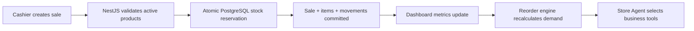

# SmartDepanneur Agent

Agent-assisted inventory, sales, expiration, and replenishment software for
Quebec convenience stores.

SmartDepanneur is a full-stack portfolio project based on real depanneur
workflows. A cashier can complete a sale, inventory is deducted atomically,
the dashboard updates store metrics, and the insight engine turns recent
sales and stock levels into practical reorder recommendations.

## Latest project update

The current branch adds persistent EN/FR/ZH selection, Owner/Cashier
onboarding, dashboard charts, a one-click daily closeout report, controlled
sale voids, localized Store Agent guidance, and one-click supplier-grouped
purchase-order drafts.

See [Current project updates](docs/PROJECT_UPDATES.md) for the implemented
workflow, permission rules, database migrations, validation evidence, demo
steps, known boundaries, and resume positioning.

## What it demonstrates

- Real retail-domain modelling instead of generic CRUD
- Next.js and React application architecture
- NestJS REST APIs with JWT authentication and RBAC
- PostgreSQL transactions through Prisma
- Atomic stock updates that prevent negative inventory
- OpenAI Responses API tool calling with a deterministic local Agent fallback
- English, French, and Simplified Chinese user interfaces
- Repeatable Docker development and production-style builds
- Automated typechecking, linting, tests, builds, and container validation

## Core workflow



## Features

### Store operations

- Product catalogue with barcode, SKU, category, supplier, unit, cost, price,
  minimum stock, and expiration settings
- Stock-in, manual adjustment, waste, return, and sales movement history
- POS-style checkout with Quebec tax, payment method, estimated profit, and
  automatic inventory deduction
- Checkout category filtering with product counts and name, barcode, or SKU
  search
- Recent sale history with reason-required, auditable voids that restore stock
- Cashier void ownership and ten-minute controls, plus Owner approval for
  cashier voids of CAD 100 or more
- Low-stock, out-of-stock, and expiration alerts
- Dashboard sales mix, seven-day trend, category comparison, void metrics, and
  operational alerts
- One-click daily closeout table and CSV with revenue, gross profit, sale
  count, and category performance
- Audit records for important operational changes

### Store Agent

- Reorder quantities derived from seven-day sales velocity and a fourteen-day
  planning horizon
- Top-seller and slow-mover analysis
- Read-only tools for reorder suggestions, top sellers, slow movers, and store
  summaries
- OpenAI function calling chooses the business tools needed for each question
- The selected UI language (`en`, `fr`, or `zh`) controls both suggested
  questions and the answer language
- Deterministic multilingual local Agent when the API is unavailable
- Logged provider, model, selected language, tools used, result, and fallback
  reason
- Twelve-second timeout so an OpenAI outage does not block store operations
- One-click generation of idempotent supplier-grouped purchase-order drafts
  from the current reorder plan

### Security and reliability

- JWT-protected store APIs
- Role and permission management
- Public self-registration restricted to Store Owner or Cashier
- Cashier access restricted to checkout; sales update inventory automatically
- Server-enforced sale void ownership, time window, reason, and large-void
  approval rules
- Required environment validation at startup
- No hard-coded production JWT fallback
- Conditional database updates that prevent concurrent sales or adjustments
  from taking stock below zero
- Database-aware health endpoint at `/api/health`
- Production startup is separated from migrations and demo seeding

## Technology

| Layer | Technology |
| --- | --- |
| Frontend | Next.js 16, React 19, TypeScript, Ant Design, Tailwind CSS, Zustand |
| Backend | NestJS 11, Node.js 22, Passport JWT, REST |
| Data | PostgreSQL 16, Prisma 5 |
| Agent | OpenAI Responses API function calling with local Agent fallback |
| Delivery | Docker Compose, GitHub Actions, Dependabot |

## Run with Docker

Requirements: Docker Desktop with Docker Compose.

```bash
docker compose up --build
```

Open:

- Application: `http://localhost:3100`
- Backend health: `http://localhost:3101/api/health`
- PostgreSQL: `localhost:5432`

The local Compose environment applies migrations and installs idempotent demo
data. Production containers do not seed data automatically.

To enable OpenAI-generated explanations:

```powershell
$env:OPENAI_API_KEY="your-key"
docker compose up --build
```

## Run without Docker

Start PostgreSQL, then configure the backend:

```powershell
Copy-Item backend/.env.example backend/.env
```

Install, migrate, and seed:

```powershell
cd backend
npm install
npm run migrate:deploy
npm run seed
npm run seed:demo
npm run start:dev
```

In another terminal:

```powershell
cd frontend
npm install
npm run dev
```

Default ports are frontend `3100`, backend `3101`, and PostgreSQL `5432`.

## Demo accounts

Demo credentials exist only in seeded demo environments.

| Role | Email | Password |
| --- | --- | --- |
| Store Owner | `owner@smartdepanneur.local` | `123456` |
| Cashier | `cashier@smartdepanneur.local` | `123456` |

Never run `seed:demo` against a production database.

## Quality checks

Run the same checks used in CI:

```powershell
npm run typecheck
npm run lint
npm run test
npm run build
```

Current backend tests cover:

- Required environment and secret validation
- Database health behaviour
- Atomic sale stock reservation
- Controlled sale voids, stock restoration, and large-void Owner approval
- Negative-stock prevention for inventory movements
- Reorder quantity calculation
- Idempotent supplier-grouped purchase-order draft generation
- Dashboard closeout, trends, and void metrics
- AI local fallback and question validation

GitHub Actions runs backend and frontend typechecking, linting, tests and
production builds. A final job validates Compose and builds both images.

## Project structure

```text
.
├── backend/
│   ├── prisma/                 PostgreSQL schema, migrations, demo seed
│   └── src/
│       ├── auth/               JWT authentication
│       ├── products/           Product catalogue
│       ├── inventory/          Stock movements and expiration alerts
│       ├── sales/              Transactional POS workflow
│       ├── dashboard/          Store KPIs
│       └── insights/           Reorder analysis and AI explanations
├── frontend/
│   ├── app/                    Next.js routes
│   ├── api/                    Typed API clients
│   ├── components/             UI and operational forms
│   └── lib/i18n/               EN / FR / ZH translations
├── docs/                       Architecture, AWS, demo, and roadmap
└── docker-compose.yml          Complete local stack
```

## Documentation

- [Architecture](docs/ARCHITECTURE.md)
- [Current project updates](docs/PROJECT_UPDATES.md)
- [AWS deployment](docs/DEPLOYMENT_AWS.md)
- [Interview demo script](docs/DEMO_SCRIPT.md)
- [Product roadmap](docs/ROADMAP.md)

## Current scope

The portfolio release is intentionally a single-store system. Draft purchase
orders are implemented; sending, receiving, and lot-level expiration remain
future increments. Multi-store tenant isolation, POS imports, invoice OCR, and
shelf vision are also documented future work rather than claimed as finished
functionality.

## Resume summary

**SmartDepanneur Agent — Agent-Assisted Retail Inventory and Replenishment Platform**

- Built a full-stack retail operations platform with Next.js, NestJS,
  PostgreSQL, Prisma, and Docker for sales, inventory, suppliers, expiration
  monitoring, audit trails, and role-based access.
- Implemented atomic stock reservation in PostgreSQL transactions to prevent
  concurrent checkouts and inventory adjustments from producing negative
  stock.
- Developed data-driven reorder recommendations from sales velocity, minimum
  stock thresholds, and procurement cost, with OpenAI explanations and a
  resilient deterministic fallback.
- Added audited sale void controls, dashboard closeout and trend analytics, and
  idempotent supplier-grouped purchase-order drafts.
- Automated TypeScript validation, linting, Jest tests, application builds, and
  Docker image validation through GitHub Actions.

## License

MIT
