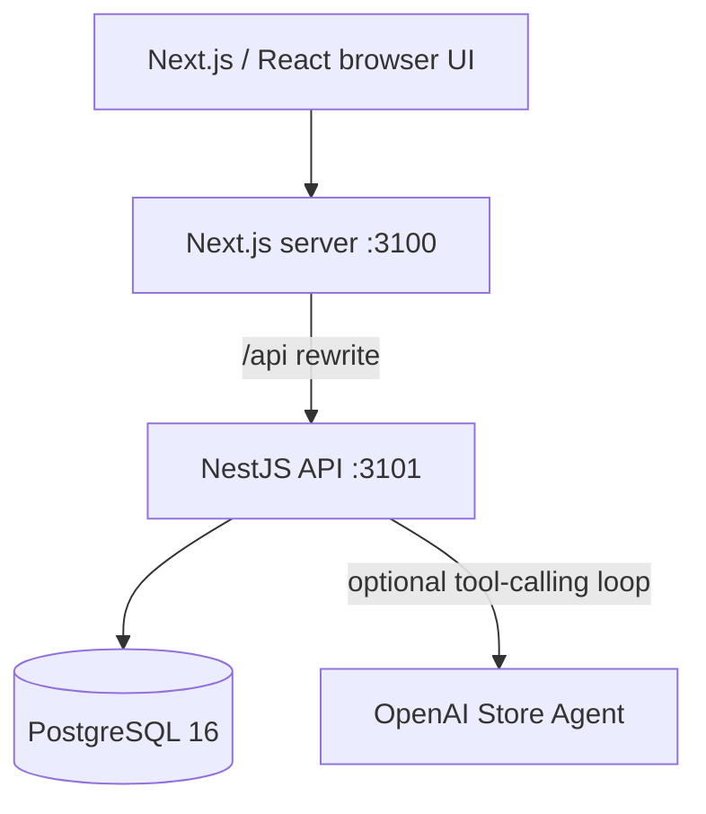

# Architecture

## Runtime

The browser uses relative `/api` URLs by default. Next.js proxies those calls
to `API_INTERNAL_URL`, so Docker uses the internal service name while local
development uses `http://localhost:3101`.

## Transaction boundary

`SalesService.createSale` resolves product prices, then performs conditional
stock decrements, sale creation, sale-item creation, and inventory-movement
creation in one Prisma transaction. The stock update includes
`currentStock >= requestedQuantity`; if another checkout has already consumed
the stock, the update count is zero and the entire transaction rolls back.

Inventory waste and adjustments use the same conditional-update pattern.

## Agent boundary

The Store Agent exposes four read-only tools: reorder suggestions, top sellers,
slow movers, and store summary. OpenAI first selects one or more tools, the
backend executes them against PostgreSQL, and a second Responses API call
turns only those tool results into an owner-friendly answer.

The UI sends `en`, `fr`, or `zh` explicitly, so the answer language follows
the user's selected interface rather than guessing from the question. A
timeout or API failure runs the same workflow through a deterministic local
Agent. Provider, model, selected language, tools used, answer, and fallback
reason are stored in `AiInsightLog`.

## Sale exception boundary

The original sale is preserved when a transaction is voided. The backend
requires a structured reason, enforces cashier ownership and a ten-minute
window, and verifies Store Owner credentials for cashier voids of CAD 100 or
more. Sale status, stock restoration, and `return_item` movements are committed
in one transaction. The operator and optional approver are retained for audit
history and dashboard exception reporting.

## Purchase-order boundary

Reorder calculations remain in the deterministic insight service.
`PurchaseOrdersService` groups those recommendations by supplier and upserts
one draft per Toronto business date and supplier. A repeated same-day action
refreshes items and totals rather than adding a duplicate order. The current
boundary stops at draft generation; supplier sending and inventory receiving
are future increments.

## Configuration

The backend refuses to start without:

- `DATABASE_URL`
- `JWT_SECRET` containing at least 32 characters

The frontend has no secret configuration. `NEXT_PUBLIC_API_URL` is optional;
relative requests and the server-side rewrite are preferred.

## Known architectural boundary

The current schema represents one store. Before onboarding multiple customers,
introduce `Organization`, `Store`, and `StoreMember`, then add `storeId` to
every operational table and enforce it in all queries.
