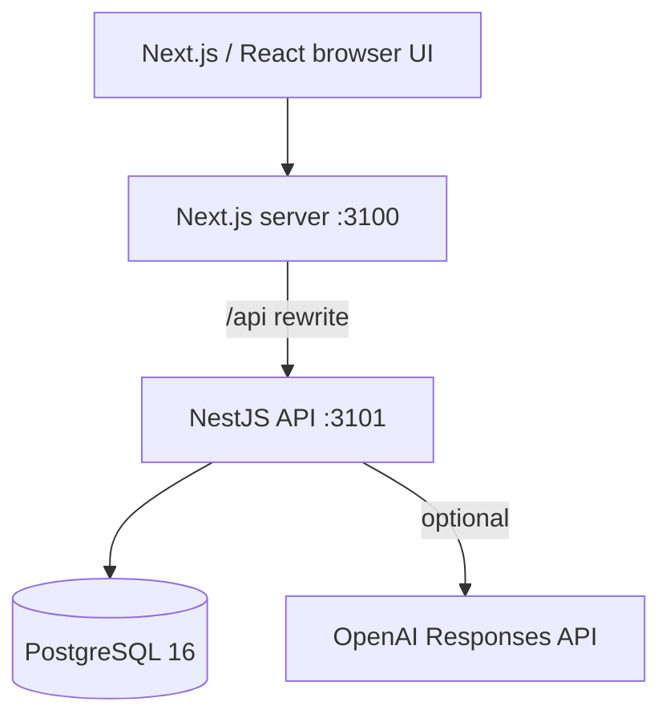

# Architecture

## Runtime

The browser uses relative `/api` URLs by default. Next.js proxies those calls
to `API_INTERNAL_URL`, so Docker uses the internal service name while local
development uses `http://localhost:3101`.

## Transaction boundary

`SalesService.createSale` resolves product prices, then performs conditional
stock decrements, sale creation, sale-item creation, and inventory-movement
creation in one Prisma transaction. The stock update includes
`currentStock >= requestedQuantity`; if another checkout has already consumed
the stock, the update count is zero and the entire transaction rolls back.

Inventory waste and adjustments use the same conditional-update pattern.

## AI boundary

The insight engine calculates business facts before calling an LLM. OpenAI
receives a bounded JSON context and instructions not to invent products or
sales. A timeout or API failure returns the already-computed local answer.
Provider, model, answer, and fallback reason are stored in `AiInsightLog`.

## Configuration

The backend refuses to start without:

- `DATABASE_URL`
- `JWT_SECRET` containing at least 32 characters

The frontend has no secret configuration. `NEXT_PUBLIC_API_URL` is optional;
relative requests and the server-side rewrite are preferred.

## Known architectural boundary

The current schema represents one store. Before onboarding multiple customers,
introduce `Organization`, `Store`, and `StoreMember`, then add `storeId` to
every operational table and enforce it in all queries.
