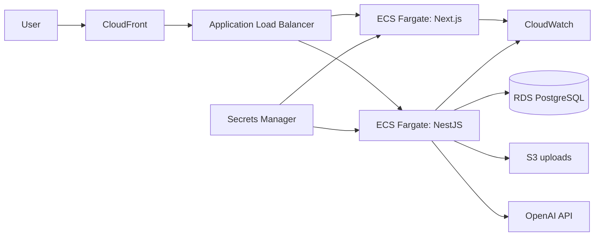

# AWS Deployment

## Recommended production topology



## AWS resources

- ECR repositories for frontend and backend images
- ECS Fargate services behind an HTTPS Application Load Balancer
- RDS PostgreSQL in private subnets with automated backups
- Secrets Manager for `DATABASE_URL`, `JWT_SECRET`, and `OPENAI_API_KEY`
- CloudWatch log groups, latency/error alarms, and container health alarms
- S3 for future invoices and shelf images
- CloudFront and Route 53 for the public domain
- GitHub Actions OIDC role instead of long-lived AWS access keys

## Deployment order

1. Build immutable images and push commit-SHA tags to ECR.
2. Run `npm run migrate:deploy` as a one-off ECS task.
3. Deploy the backend service and wait for `/api/health`.
4. Deploy the frontend with the internal/public API routing configured.
5. Run login, dashboard, sale, inventory, and insight smoke tests.
6. Promote the image tags only after the smoke test succeeds.

Do not execute `npm run seed:demo` in production.

## Required production variables

Backend:

```text
DATABASE_URL
JWT_SECRET
FRONTEND_URL
OPENAI_API_KEY              optional
OPENAI_MODEL                optional
NODE_ENV=production
PORT=3101
```

Frontend:

```text
API_INTERNAL_URL
NEXT_PUBLIC_API_URL         optional when routing through the same origin
```

## Operational minimum

- RDS deletion protection and point-in-time recovery
- TLS-only ingress
- ECS tasks in private subnets
- Secret rotation procedure
- Database migration rollback notes per release
- Alarms for 5xx rate, database connections, CPU/memory, and health failures
- Monthly dependency review and restore drill
